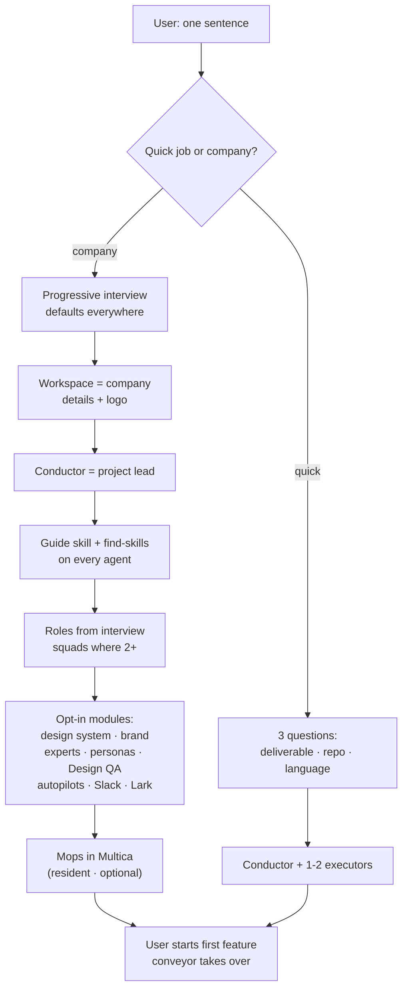
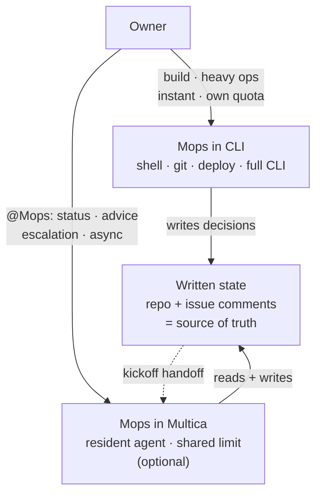
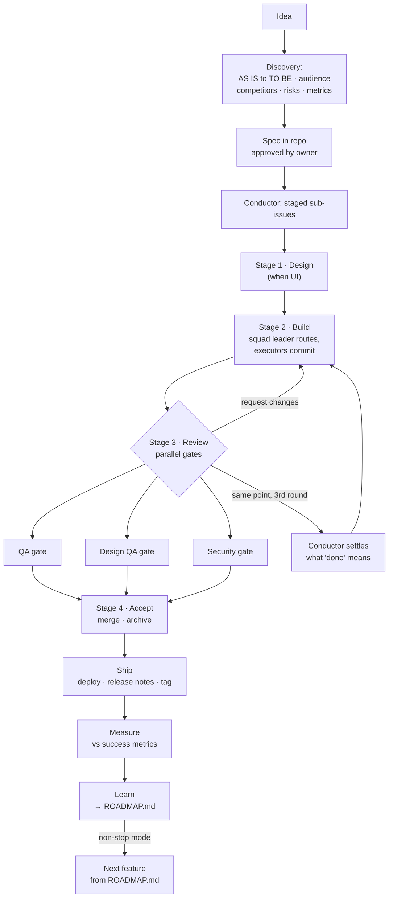
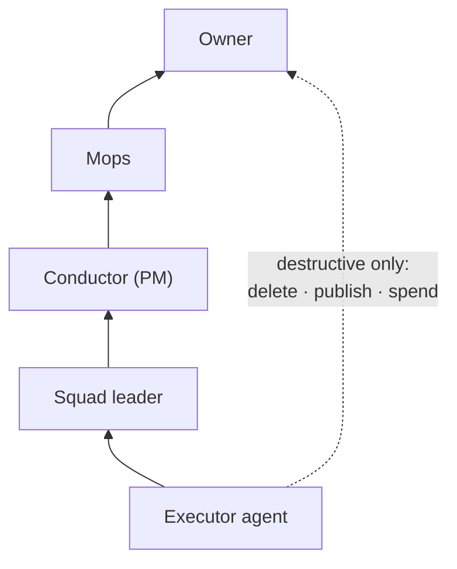
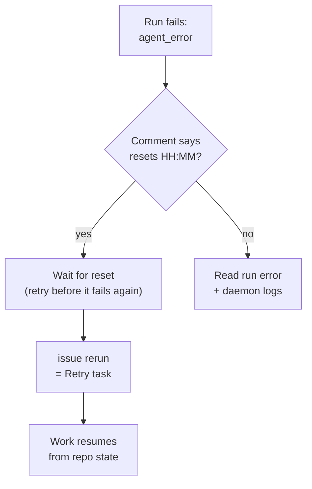
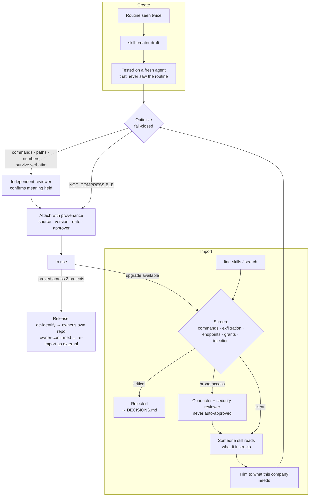

# Workflow diagrams

Mermaid renders on GitHub, in Obsidian, and on the docs site.

## Contents

Bootstrap · Two seats of Mops · One feature through the conveyor · Escalation & control ·
Session limits · The skill lifecycle

## Bootstrap — from a sentence to a working company

## Two seats of Mops

## One feature through the conveyor

> A stage is a **barrier, not a queue**: everything genuinely independent goes on the *same*
> stage and runs concurrently — the numbers order dependencies, not tasks. And width is only
> real on a `github_repo` project; a `local_directory` serializes everything regardless.

## Escalation & control

## Session limits — detect and recover

## The skill lifecycle — gates, not ceremony

> The loop back to **Screen** on upgrade is the point most setups miss: a version you vetted
> is not the version you are about to install.
