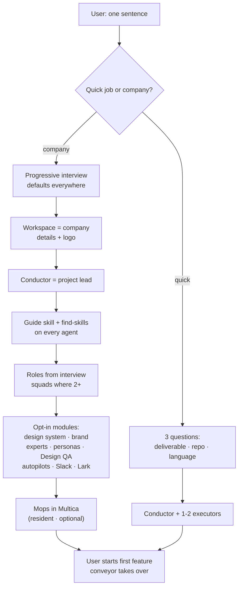
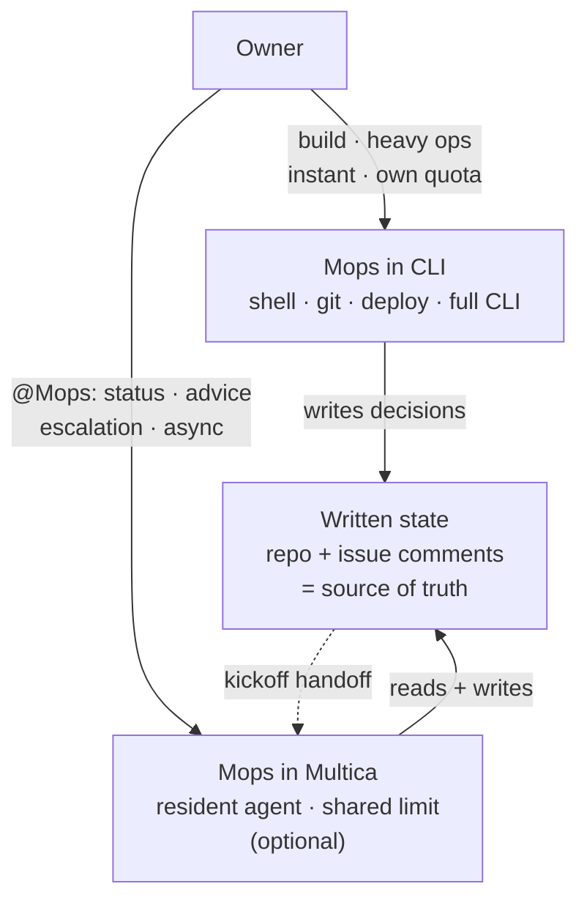
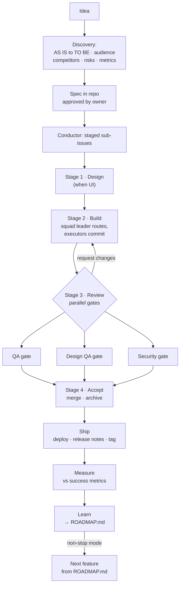
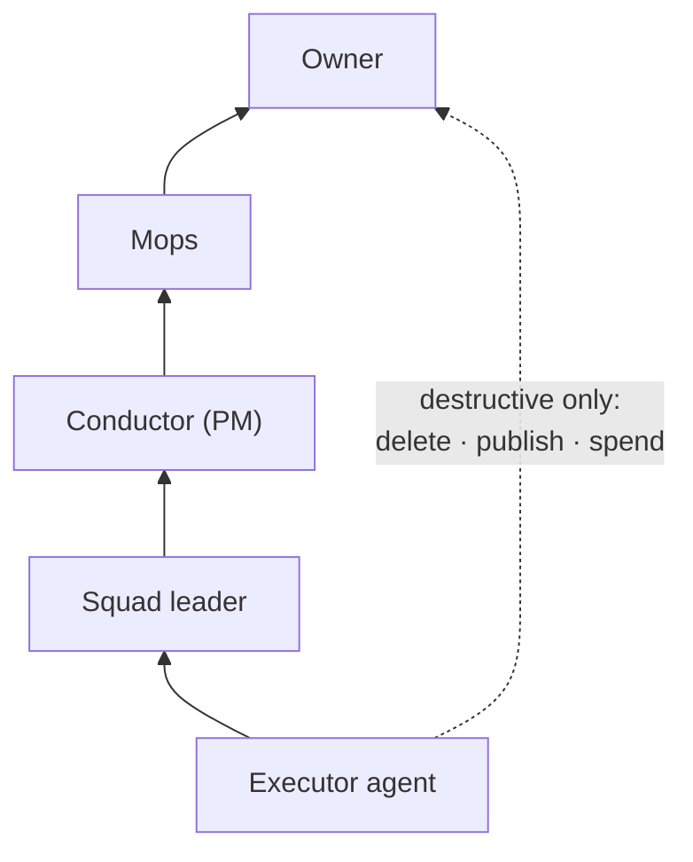
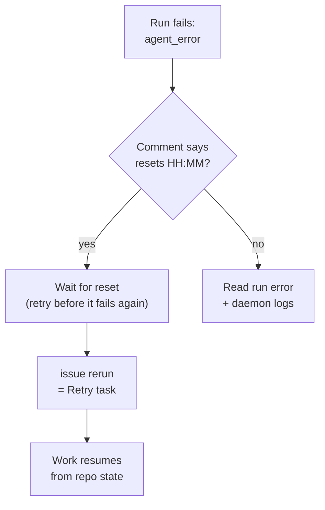

# Workflow diagrams

Mermaid renders on GitHub, in Obsidian, and on the docs site.

## Bootstrap — from a sentence to a working company

## Two seats of Mops

## One feature through the conveyor

## Escalation & control

## Session limits — detect and recover

