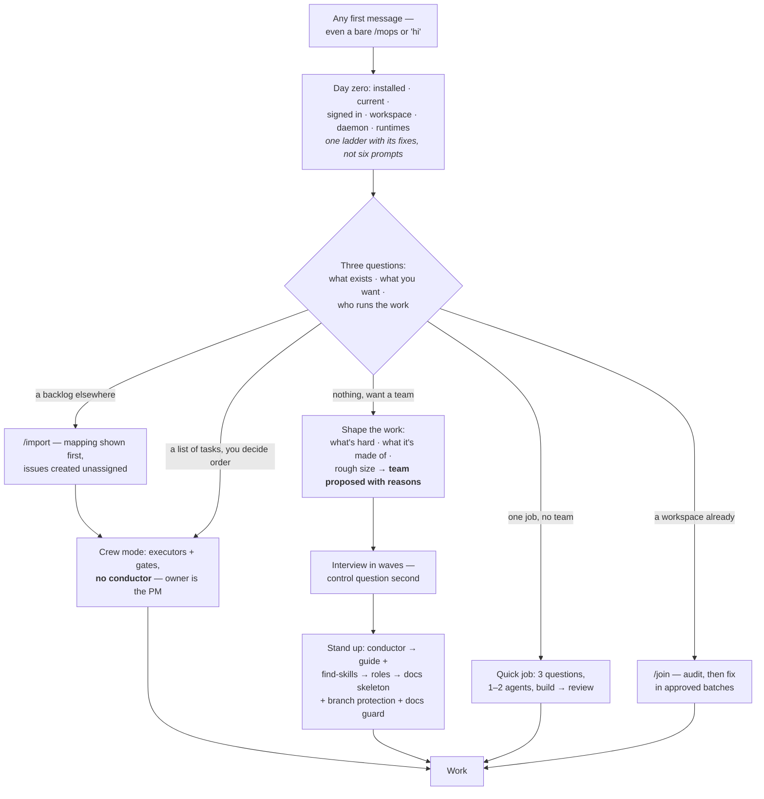
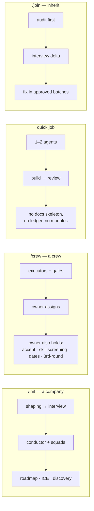
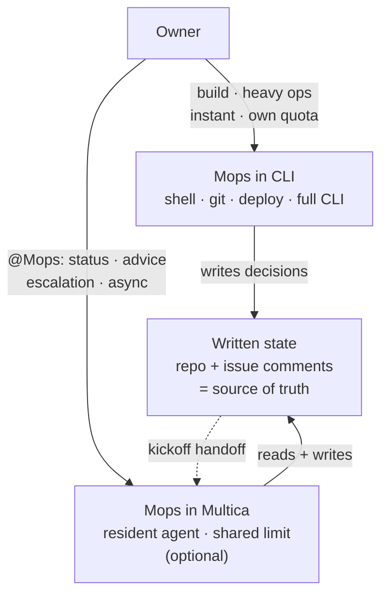
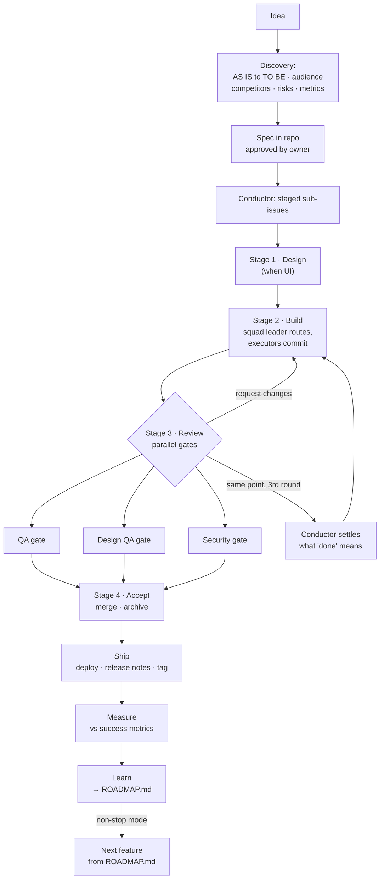
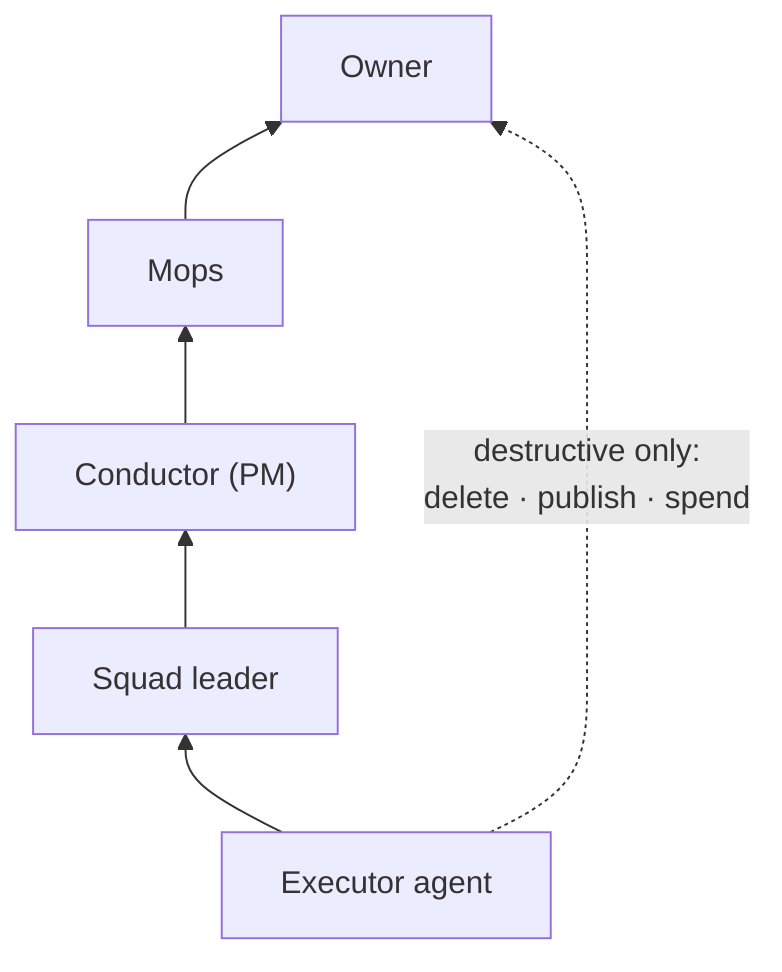
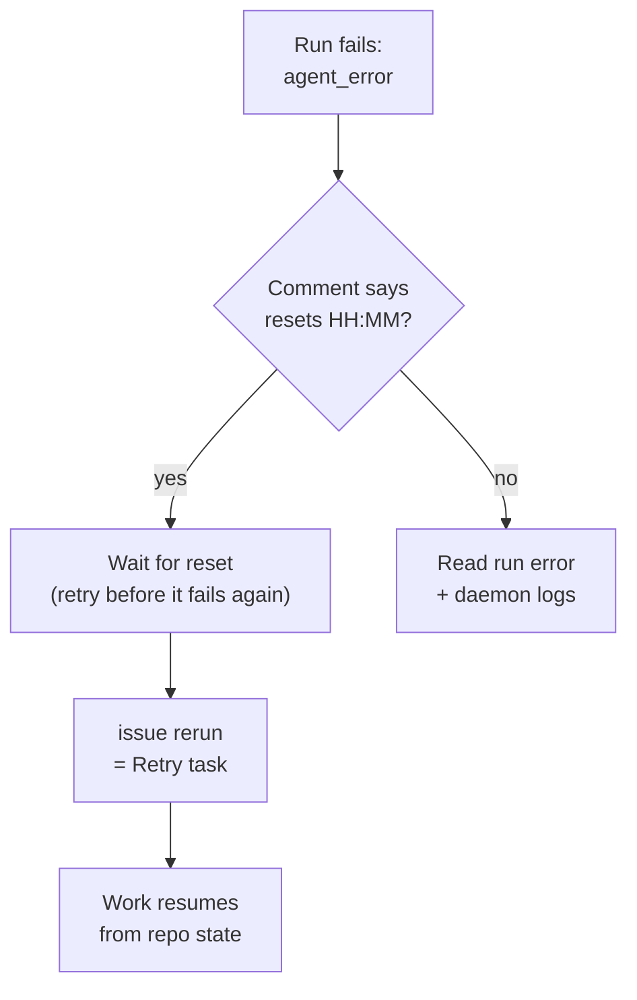
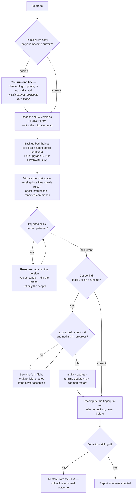
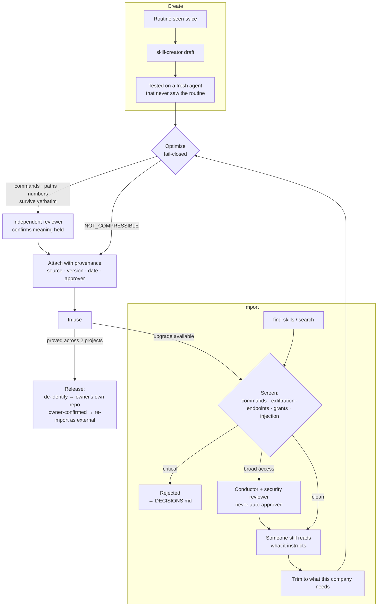

# Workflow diagrams

Mermaid renders on GitHub, in Obsidian, and on the docs site.

## Contents

- [From first message to a working company](#from-first-message-to-a-working-company)
- [The four routes, side by side](#the-four-routes-side-by-side)
- [Two seats of Mops](#two-seats-of-mops)
- [One feature through the conveyor](#one-feature-through-the-conveyor)
- [Escalation & control](#escalation-control)
- [Session limits — detect and recover](#session-limits-detect-and-recover)
- [Getting current — what /upgrade actually walks](#getting-current-what-upgrade-actually-walks)
- [The skill lifecycle — gates, not ceremony](#the-skill-lifecycle-gates-not-ceremony)

## From first message to a working company

> Nobody is asked to choose a command. Crew mode is the **default offer after `/import`** —
> someone who just moved their backlog has already decided what the work is. Adding a
> conductor later is an upgrade, not a redo.

## The four routes, side by side

## Two seats of Mops

## One feature through the conveyor

> A stage is a **barrier, not a queue**: everything genuinely independent goes on the *same*
> stage and runs concurrently — the numbers order dependencies, not tasks. And width is only
> real on a `github_repo` project; a `local_directory` serializes everything regardless.

## Escalation & control

## Session limits — detect and recover

## Getting current — what `/upgrade` actually walks

> Two things this picture exists to prevent: **new bytes without a migration** (half the
> company on one version, half on another), and **a CLI replaced under a running agent**,
> which produces failures that look like the agent's fault.

## The skill lifecycle — gates, not ceremony

> The loop back to **Screen** on upgrade is the point most setups miss: a version you vetted
> is not the version you are about to install.
