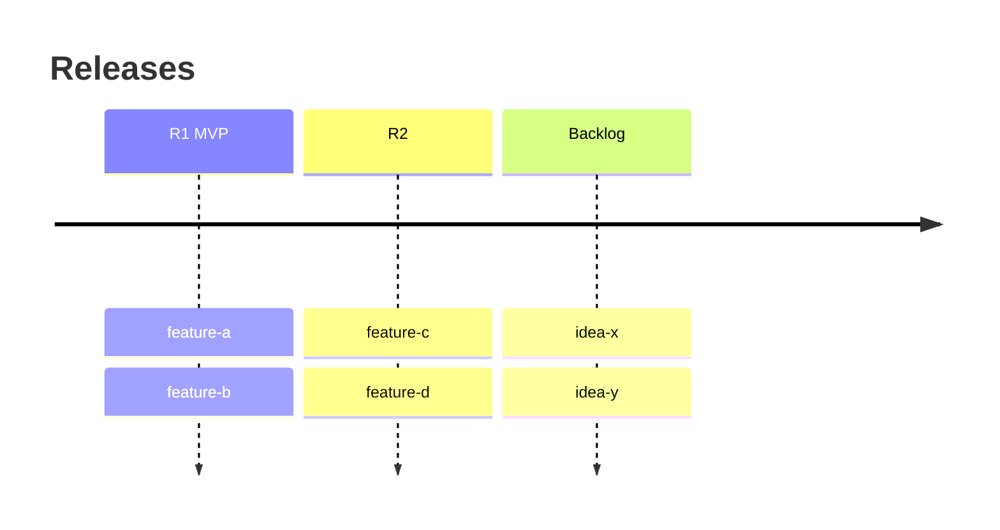

# Roadmap — {{Company}}

Release plan (User Story Map). Order between features lives HERE, never in issue
titles. Prioritization: ICE (impact · confidence · ease), rescored when scope moves. **Each score
carries its basis** — a metric, a ticket count, a comparable task's real duration — or is
marked *(judgement)*. Before the order is acted on, move each score by one point: if the
top few swap, the ranking is not yet a decision, and the note says what would settle it.

## R1 — {{goal of the release, one line}}
| Feature | ICE (basis) | Status | Issue |
|---|---|---|---|
| feature-a | 8·9·7 | in progress | JAM-1 |

## R2 — {{goal}}
…

## Backlog (unscheduled)
| Feature | ICE | Notes |
|---|---|---|
