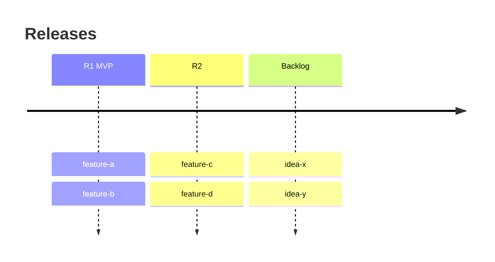

# Roadmap — {{Company}}

Release plan (User Story Map). Order between features lives HERE, never in issue
titles. Prioritization: ICE (impact · confidence · ease), rescored when scope moves.

## R1 — {{goal of the release, one line}}
| Feature | ICE | Status | Issue |
|---|---|---|---|
| feature-a | 8·9·7 | in progress | JAM-1 |

## R2 — {{goal}}
…

## Backlog (unscheduled)
| Feature | ICE | Notes |
|---|---|---|
