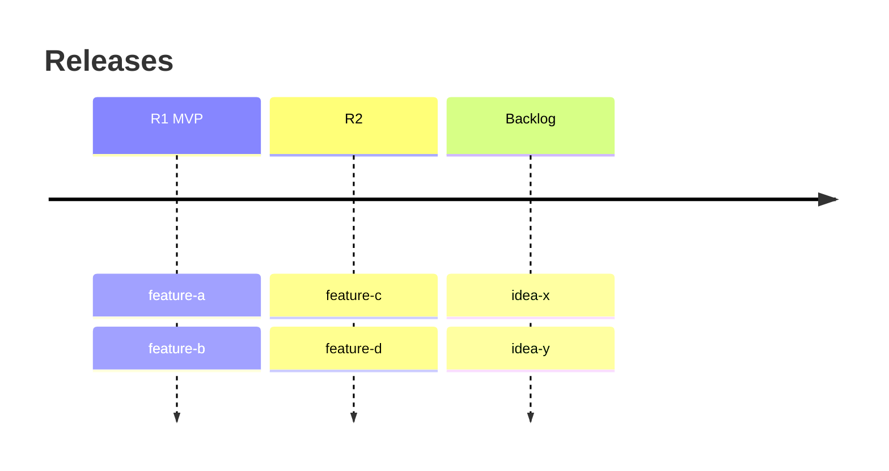

# Roadmap — {{Company}}

Release plan (User Story Map). Order between features lives HERE, never in issue
titles. Prioritization: **ICE by default** (impact · confidence · ease), rescored when scope moves — and **the framework is named in the cell**, because it is chosen before the scores and a list scored two ways is a list arriving where it already meant to go. Alternatives and the question each answers: REFERENCE §11. **Each score
carries its basis** — a metric, a ticket count, a comparable task's real duration — or is
marked *(judgement)*. Before the order is acted on, move each score by one point: if the
top few swap, the ranking is not yet a decision, and the note says what would settle it.

```mermaid
timeline
    title Releases
    R1 MVP : feature-a : feature-b
    R2     : feature-c : feature-d
    Backlog: idea-x : idea-y
```

## R1 — {{goal of the release, one line}}
| Feature | Score (framework · basis) | Status | Issue |
|---|---|---|---|
| feature-a | ICE 8·9·7 (analytics) | in progress | JAM-1 |

## R2 — {{goal}}
…

## Backlog (unscheduled)
| Feature | Score (framework) | Notes |
|---|---|---|
